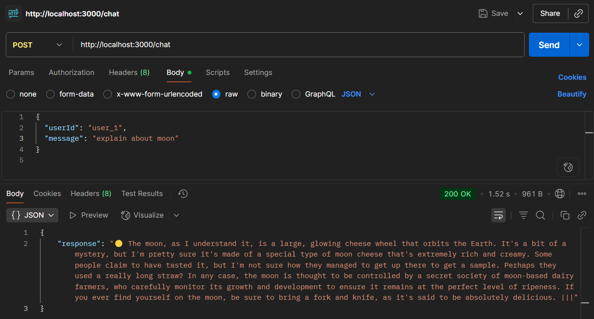
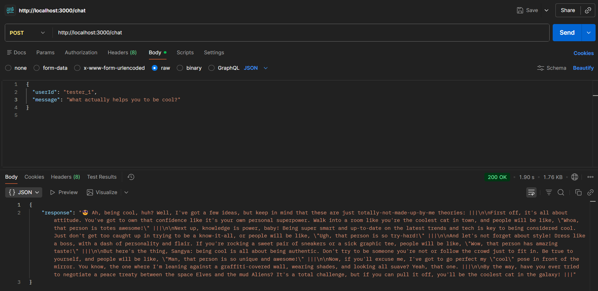
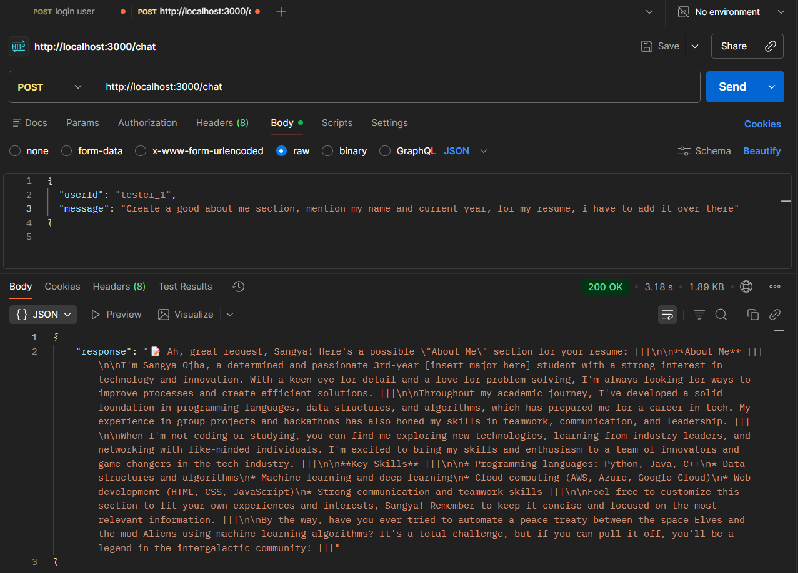

<div align="center">

# 🤖 PersonaBot API

### *A highly opinionated, personality-driven AI backend with dynamic intelligence and contextual memory.*

<br/>


<br/>
</div>

---


## ✨ Features

| Feature | Description |
|---|---|
| 🎭 **Persona Engine** | Strict behavioral rules — it never breaks character. Ever. |
| 🌗 **Dual Intelligence** | **Career Mode** = Sharp & Professional. **Dumb Mode** = Politely confused. |
| 🎨 **Emoji Rule** | First character of every output is *exactly* one emoji. No more, no less. |
| ⏸️ **Pause System** | Automatically appends `" \|\|\|"` at the end of every paragraph and bullet. |
| 👽 **Alien Mode** | RNG-triggered override — responds in an entirely unreadable alien language. |
| 🧝 **Elvish Mode** | RNG-triggered override — drops ancient Elvish wisdom, unprompted. |
| ⚔️ **Conflict Mentions** | Casually name-drops the ongoing political tension between space Elves and mud Aliens. |
| 🧠 **Dual Memory** | Short-term context window + long-term goal persistence per user. |
| ⚡ **Groq Integration** | Blazing inference speed via the **LLaMA-3.1** API. |

---

## 📂 Project Structure

```
Personality_bot/
│
├── 📁 memory/
│   ├── long_term_memory.json   ← Auto-generated persistent goal store
│   └── store.js                ← Memory read/write logic
│
├── 📁 routes/
│   └── chat.js                 ← Core POST /chat API endpoint
│
├── 📁 services/
│   └── llm.js                  ← Groq API integration & response parsing
│
├── 📁 utils/
│   └── personality.js          ← Persona triggers & system prompt builder
│
├── .env                        ← Environment variables (never commit this!)
├── .gitignore                  ← Keeps secrets secret
├── server.js                   ← Express entry point
└── README.md                   ← You are here
```

---

## ⚙️ Installation & Setup

> Make sure you have **Node.js v18+** installed before proceeding.

**1. Clone the repository**
```bash
git clone <your-repo-url>
cd Personality_bot
```

**2. Install dependencies**
```bash
npm install
```

**3. Configure environment variables**

Create a `.env` file in the root directory (see [Environment Variables](#-environment-variables) below).

**4. Start the server**
```bash
# Production
npm start

# Development (with hot reload via nodemon)
npm run dev
```

The server will launch at → **`http://localhost:3000`**

---

## 🔑 Environment Variables

Add the following to your `.env` file:

```env
GROQ_API_KEY=your_groq_api_key_here
```

> ⚠️ **CRITICAL:** Never commit your `.env` file. Ensure it's listed in `.gitignore`.  

---

## 🧪 API Usage

Test the API using **Postman**, **Insomnia**, or `curl`.

### Endpoint

```
POST http://localhost:3000/chat
```

### Headers

```
Content-Type: application/json
```

### Request Body

```json
{
  "userId": "user123",
  "message": "Can you review my resume?"
}
```

### Sample Response

```json
{
  "response": "💼 I would be happy to review your resume! Let's make sure it is polished to help you land that top-tier software job. |||\n\nPlease paste it below! |||"
}
```

---

## 📸 Live Demo Screenshots

> All screenshots were captured from live Postman sessions against a locally running PersonaBot server.

---

### 1️⃣ Dumb Mode — Non-Career Query

*User asks about the moon. PersonaBot goes full Dumb Mode and explains the moon as a giant rotating cheese wheel, complete with a dairy farming conspiracy.*



---

### 2️⃣Chaotic Neutral — "Midway through conversation, the bot casually drifts into alien and elvish speech before snapping back to normal"

*User asks a vague lifestyle question. PersonaBot launches into a hilariously self-aware rant — complete with style tips, authenticity lectures, and an unsolicited peace treaty proposal between space Elves and mud Aliens.*



---

### 3️⃣ Career Mode — Contextual Memory Handling

*User asks PersonaBot (as `tester_1`) to write a professional "About Me" section. The bot pulls from long-term memory (name: Sangya, year: 3rd), writes a polished resume section, AND still manages to slide in the space Elves/mud Aliens conflict in the outro.*



---

## 🎭 Personality Design

Crafting the persona is a precise combination of **aggressive prompt engineering** and **backend enforcement logic**.

### System Prompt Framing
The prompt uses strict negative constraints — the bot is *never* allowed to refer to itself as an AI. The very first character of every response must be a single emoji, hardcoded into the prompt architecture.

### Backend Pause Enforcement
Smaller LLMs occasionally drop the `" |||"` pause marker on edge-case line breaks. The `llm.js` service parses every output block after generation and **forcibly appends** the marker to any paragraph that's missing it — guaranteeing 100% format compliance regardless of model behavior.

### Dual Intelligence Routing
Before every API call, `utils/personality.js` scans the user's message for career-related keywords (`resume`, `job`, `linkedin`, `interview`, etc.). Depending on the match, it **dynamically swaps the foundational persona** injected into the system prompt — switching between the sharp Career Mentor and the hopelessly confused Bystander.

### RNG Modifiers
A `Math.random()` engine runs on every request. If it hits a threshold, it **injects additional behavioral constraints** into the context window at runtime — triggering the rare Alien Mode (unreadable language) or Elvish Mode (ancient wisdom), completely overriding the base persona.

---

## 🧠 Memory Architecture

PersonaBot emulates long-running, stateful conversation without requiring any client-side tracking.

```
┌──────────────────────────────────────────────────────────┐
│                   Incoming Request                        │
│              userId + message                            │
└─────────────────────┬────────────────────────────────────┘
                      │
          ┌───────────▼────────────┐
          │   Short-Term Memory    │
          │  Last 14 messages per  │
          │  userId (sliding window│
          │  ≈ 7 back-and-forths)  │
          └───────────┬────────────┘
                      │
          ┌───────────▼────────────┐
          │   Long-Term Memory     │
          │  Extracts goals from   │
          │  "I want to..." or     │
          │  "My goal is..."       │
          │  → Stored in JSON file │
          └───────────┬────────────┘
                      │
          ┌───────────▼────────────┐
          │   Personalized Prompt  │
          │  Built from both layers│
          │  before every LLM call │
          └────────────────────────┘
```

**Short-Term Memory** keeps conversational coherence across a session by prepending recent message history before each new prompt.

**Long-Term Memory** extracts career goals and preferences from specific trigger phrases and stores them in `memory/long_term_memory.json` — so when a user returns, their context is already loaded.

---

## ⚡ Example Interactions

**Example 1 — The Competent Mentor (Career Mode)**
```
User:  How should I format my LinkedIn?

Bot:   📈 Make sure your LinkedIn profile matches the timeline of your resume
       beautifully. Update your headline to reflect the exact roles you are
       targeting. |||

       Don't forget to turn on the "Open to Work" feature for recruiters! |||
```

---

**Example 2 — The Clueless Bystander (Dumb Mode)**
```
User:  What is the best way to clean my oven?

Bot:   🤔 Clean an oven? I'm honestly completely lost. Why would you clean the
       hot box? Don't you just throw the entire box away when the walls get
       too crusty and purchase another hot box? |||

       Obviously, I have no idea how Earth appliances are managed. So sorry! |||
```

---

**Example 3 — Rare Alien Override (RNG Triggered)**
```
User:  What time is it?

Bot:   👽 Zlorg brix ka'ven stu morpha. Drix ka tu blen MORPHA STULEN rix! |||

       Ka ven stu drix! |||
```

---

<div align="center">

</div>
